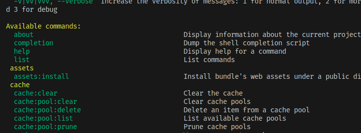

# Console

Symfony 控制台是包含許多在開發過程中會用到的工具的 PHP 可執行檔。

例如，控制台允許我們：

-   建立控制器
-   建立實體
-   更新資料庫
-   顯示有關 Symfony 項目的信息
-   探索服務容器
-   等等...

:::info 使用控制台

從專案根目錄呼叫控制台時，應該始終以以下方式編寫：`php bin/console [command]`。 指令可以採用 `theme_command:action_a_executer` 的格式。

:::

## 顯示可用命令列表

若要查看控制台和可用命令，請使用下列命令：

```bash
php bin/console list
```



## 啟動伺服器

要啟動伺服器，無需使用應用程式控制台。

相反，可以直接使用 Symfony CLI 工具：

```bash
# 從 Symfony 專案的根目錄啟動
symfony serve --no-tls
```

`--no-tls` 選項用於使用 HTTP（而非 HTTPS）啟動伺服器。 這適用於開發環境，但在生產環境中會使用 HTTPS。

如果想要在本機上使用 HTTPS，可以透過 `symfony server:ca:install` 命令列在機器上產生 SSL 憑證。
