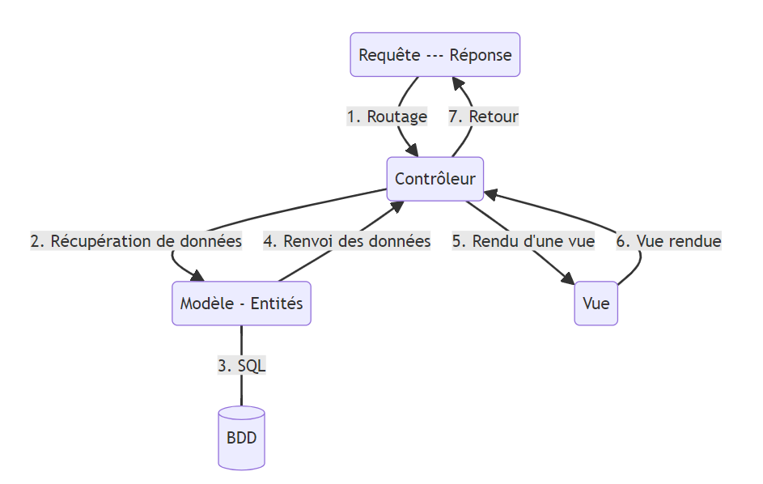

# 控制器

如果在安裝應用程式後立即啟動伺服器，我們會發現我們沒有任何首頁。 相反，Symfony 提供了一個特殊的首頁，顯示已安裝的 Symfony 版本，並提供一條訊息，告訴我們之所以看到這個頁面，是因為我們沒有配置主頁。

## 建立控制器

:::tip 控制器
控制器用於接收和處理應用程式中的請求。
:::

透過使用控制台和 `MakerBundle`，我們將創建應用程式的第一個控制器，並配置它在首頁上運行。

```bash
php bin/console make:controller
```

我們將命名 `IndexController` 類，然後查看 maker 建立的 `src/Controller/IndexController.php` 檔案的內容。

:::note 快速方式(RACCOURCI)
我們也可以使用 `php bin/console IndexController` 指令，這樣控制台會直接建立文件，而不會詢問我們控制器類別的名稱
:::

## 控制器類

在由 Maker 建立的類別中，我們找到一個名為 `index` 的函數，該函數將傳回一個 `Response`（回應）。 這是 Symfony 的基本原理：**請求/回應模型**。 控制器負責對給定的路由（即 URL）執行操作。 因此，它將接收一個請求，然後為發起請求的客戶端產生一個回應。

:::note 控制器類

關於控制器類別的一點說明：該類別擴充了一個抽象類別 `AbstractController`，而正是這個抽象類別為它提供了控制器的功能。 此外，請記住，在 PSR-4 自動載入時，控制器的命名空間是 `App\Controller` ，因為它位於 `src/Controller` 資料夾中。

:::

### HttpFoundation

請求/回應模型完全由 Symfony 軟體包管理：[`symfony/http-foundation`](https://packagist.org/packages/symfony/http-foundation)。

簡而言之，該套件提供了一個物件導向的接口，用於表示 HTTP 請求和回應。 例如，我們不使用超全域變數 `$_GET` 和 `$_POST`，而是使用 `SymfonyComponent\HttpFoundation\Request` 類別的查詢和請求屬性。

## `Route` 屬性

在這個函數的簽章上方，我們會發現一個 `Route` 屬性，它來自 Symfony 的 `Routing` 元件：

```php
// use Symfony\Component\Routing\Annotation\Route;
// ...

#[Route('/index', name: 'app_index')]

```

透過該屬性，我們可以定義與路由相關聯的 URL、路由名稱、授權的 HTTP 方法等。因此，這裡的 `index` **方法**代表我們的控制器。

:::info 註解
在 PHP8 之前，路由是以**註解**的形式編寫的。 然後，這些註解會被封包解析，以便註冊路由。

因此，語法也有所不同，例如 ：

```php
/**
 * @Route("/index", name="app_index")
 */
public function index(): Response
{
  //...
}

```

在 PHP8 中，屬性被整合到了 PHP 語言中，因此無需依賴分析註釋的外部軟體包。
:::
在 Symfony 應用程式中，我們將建立一組**路由**。 然後，可以使用戶重定向到路由，或根據路由名稱產生指向頁面的鏈接等。

## 控制器的作用

控制器的基本功能是與模型通信，然後請求呈現視圖，如指令 `$this->render('...',[...]);` 。

這個控制器會觸發模板的渲染，而模板就是**視圖**，也就是我們**頁面的顯示內容**。

`php bin/console make:controller` 指令建立了另一個 `templates/index/index.html.twig` 檔案。 這是控制器呼叫的視圖檔案。

:::caution 應用邏輯
因此，控制器將負責執行應用程式的**邏輯**。 如前所述，它將能夠與**模型**通訊以獲取數據，然後將這些數據提供給**視圖**和顯示模板等。
:::

在 MVC 模型（模型-視圖-控制器）中，控制器負責執行應用程式的邏輯：

