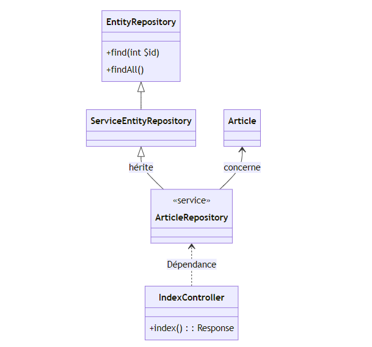
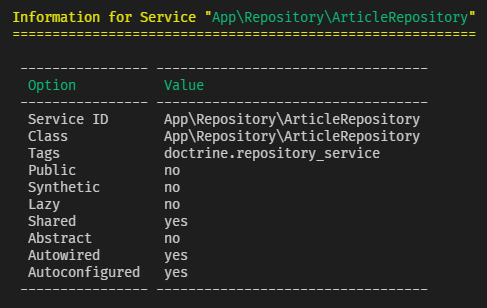

# 顯示數據

現在，我們的資料庫中已經自動產生了隨機資料。

現在我們可以在螢幕上顯示它們！

要顯示它們，我們的**視圖**必須具有要顯示的一組文章。

:::info MVC
在 MVC 模式中，控制器負責在模型和視圖之間充當「黏合劑」。 在 Symfony 中，它將負責從服務層（儲存庫）取得文章，然後將取得的結果傳遞給視圖。
:::

## 儲存庫

在 Symfony 中，儲存庫充當**服務層**。

一般來說，在應用程式中，服務提供了我們可以從應用程式的其他地方使用的功能。 服務通常由一個類別表示，提供的功能由方法表示。

因此，在我們的例子中，**儲存庫可以被視為一個應用服務，使我們能夠與資料庫就特定主題（實體）進行對話。**

在建構函式中，我們可以看到在實體上的這種 “部門化(sectorisation)”，例如：

```php
// src/Repository/ArticleRepository.php
//...
public function __construct(ManagerRegistry $registry)
{
    parent::__construct($registry, Article::class); // <-- 這裡指的是文章實體
}
//...
```

如果我們再深入研究這個類，就會發現它繼承自 `ServiceEntityRepository` 類，而 `ServiceEntityRepository` 類別又繼承自 `EntityRepositor`y 類別。 最後這兩個檔案屬於 Doctrine 包，所以我們**不能試圖**修改它們（它們在 vendors 的某個地方）。

快速瀏覽 `EntityRepositor`y 類別就會發現，我們的 `ArticleRepositor`y 繼承了`find`、`findAll`、`findBy`等公共方法...

:::info ORM 的優勢
這些方法是我們要在控制器中使用的方法，這些方法可以用在 repository 的實例上，這樣我們就可以檢索文章，而無需自己編寫 SQL。 我們堅持使用基於物件的方法，Doctrine 將為我們完成剩下的工作
:::

## 依賴注入簡介

舉個例子：如果我們想顯示所有文章。 主要問題是控制器需要有一個 `ArticleRepository` 的實例，才能使用該服務提供的方法。 這樣，我們的控制器就**依賴**我們的儲存庫：為了實現功能，它需要一個儲存庫實例，以便呼叫所需的方法。



我們可以使用的第一種方法是在控制器中實例化一個儲存庫：

```php
//...
class IndexController extends AbstractController
{
  #[Route('/', name: 'app_index')]
  public function index(): Response
  {
    $articleRepository = new ArticleRepository();
  }
  //...
}
```

問題在於**建構函數的簽名需要一個參數**！ 因此我們需要解決第二個問題：如何實例化這個參數。 但這個參數的類型是 `ManagerRegistry`，而 `ManagerRegistry` 是一個介面！ 我們不能實例化一個介面...

有一個更簡單的方法來取得 `ArticleRepositor`y 的實例：我們將其直接**注入**到控制器中。 要管理實例注入，我們只需依賴 Symfony** 容器**。

### 容器

Symfony 容器是編譯在應用程式 `var/cache` 資料夾中的一組類別。 它由 Symfony 自動編譯。

它將包含有關應用程式的各種信息，尤其是應用程式中的服務列表。

為了找到這些服務，它會搜尋 `src/` 資料夾中可用作服務的類別。

事實上，它在 `src/` 資料夾中尋找並不神奇，而是來自 Symfony 的預設配置：

```php
# config/services.yaml

#...

services:
  # ...

  # makes classes in src/ available to be used as services
  # this creates a service per class whose id is the fully-qualified class name
  App\:
    resource: "../src/"
    exclude:
      - "../src/DependencyInjection/"
      - "../src/Entity/"
      - "../src/Kernel.php"
#...
```

:::danger YAML 格式
請注意 YAML 檔案的格式：這是一種用於聲明配置元素的格式。 這些元素可以被分組到不同的部分。 在一個部分中，所有具有額外縮排等級的元素將被分組在一起。 在處理縮排等級時的錯誤可能會導致您的檔案變得無效！
:::

在這裡，在 `service` 部分，容器能夠瀏覽 `src/` 中的所有類，但不包括我們不希望將其註冊為服務的某些檔案和資料夾（使用 `exclude` 指令）。

因此，我們可以推斷出，容器將所有的儲存庫識別為應用程式服務，可以在需要的地方使用。

例如，如果我想要在我的控制器中對關於文章資料與資料庫通信，我可以注入一個類型為 `ArticleRepository` 的參數，以使用此服務提供的方法。 因此，我將在我的控制器中**註入**該服務：

```php
class IndexController extends AbstractController
{
  //...
  public function index(ArticleRepository $articleRepository): Response
  {
    // 1 - 透過與服務層通訊獲得這些項目
    $articles = $articleRepository->findAll();

    // 2 - 我將文章轉移到要顯示的視圖中
    return $this->render('index/index.html.twig', [
      'articles' => $articles,
    ]);
  }
  //...
}
```

:::info 類型提示(TYPE-HINTING)
這種方法稱為 `類型提示`：它涉及為方法參數指定預期類型。 然後，容器會識別這種類型，因為它已經透過探索 `src/` 中的檔案發現了這種類型，因此，如果它知道這種類型，就能注入與之對應的服務。

:::

總之，我們可以說 `ArticleRepository` 是控制器的一個**依賴項**，因為後者需要這個服務才能正常運行，也就是能夠檢索它要傳送給視圖的文章。

因此，我們將此**依賴關係注入**到控制器中。

:::note 控制反轉（IOC）
在註入服務時，我們也使用了**控制反轉**：在某種程度上，我們不再控制服務的實例化，而是將其委託給另一個應用模組（在本例中，可能是 `symfony/dependency- injection` 組件）。
:::

## 探索服務容器

使用應用程式控制台，可以要求 Symfony 顯示它提供的服務：

```bash
php bin/console debug:container
```

顯示的清單有點長。 事實上，服務容器不僅包含我們在應用程式中定義的服務，還包含**我們安裝的第三方軟體包（即我們專案的依賴項）聲明的服務**。

這就是為什麼如果你查看列表，會發現日誌服務、電子郵件發送服務、翻譯服務、安全服務等。

我們可以要求 Symfony 過濾該列表，例如，如果想了解我們的 `ArticleRepository` 訊息，可以要求 Symfony 過濾該列表：

```bash
php bin/console debug:container Article
```



目前，我們要記住的是，在服務容器中，編寫的服務是**私有**的。 因此，我們不能使用容器手動從任何地方檢索這些服務。 相反，我們將直接在控制器中使用**類型提示(type-hint)**。

## 在 Twig 視圖中顯示集合的元素

我們的控制器有一種檢索項目集合的方法，可以將其傳遞給視圖。 這是透過 `render` 方法實現的：

```bash
public function index(ArticleRepository $articleRepository): Response
{
  $articles = $articleRepository->findAll();

  return $this->render('index/index.html.twig', [
    'articles' => $articles,
  ]);
}
```

然後，我們在 `render` 方法的第二個參數中定義模板將能夠操作的一個或多個變量：這是一個關聯數組，定義了一個變量的名稱作為鍵，並與之關聯的值。

在對應的 Twig 範本中，我們將遍歷集合以顯示每個元素。 為此，我們將使用一個 [for](https://twig.symfony.com/doc/3.x/tags/for.html)循環：

```php
<ul>
  
    <li>{{ article.title }}</li>
  
</ul>
```

請注意，為了顯示 `Article` 物件中的字段，Twig 允許我們使用點 `.`

實際上，需要記住 Twig 用來顯示對應屬性的機制。 例如，在我們的例子中，`title` 屬性被標記為私有 `private` 。 那麼 Twig 如何猜測如何存取其值呢？

答案就在這個[鏈接](https://twig.symfony.com/doc/3.x/templates.html#variables)：當試圖存取一個變量的屬性時，Twig 有幾種探索變量的可能性。

在我們的例子中，它停留在 "如果 foo 是一個對象，檢查 getBar 是否是一個有效的方法"，其中 `foo` 是我們的文章變量，而 `getBar` 是我們的 `getTitle` 方法。

對於類別列表，我們將在控制器中重複使用相同類型的操作，但使用 `CategoryRepository` (類別儲存庫)。 然後，將類別傳遞給視圖：

```php
class CategoryController extends AbstractController
{
  /**
   * @Route("/categories", name="categories_list")
   */
  public function list(CategoryRepository $categoryRepository): Response
  {
      $categories = $categoryRepository->findAll();

      return $this->render('category/list.html.twig', [
          'categories' => $categories
      ]);
  }
}
```

然後，在視圖中：

```php
<ul>
  
      <li>
          {{ category.name }} ({{ category.articles|length }} articles)
      </li>
  
      <li>Aucune catégorie trouvée</li>
  
</ul>
```

這裡有兩個新元素：

-   Twig 的 `for` 結構還包括一個 `else` 元素，如果在清單中找不到元素，它可以用來定義顯示。
-   可以在 Twig 中使用 [**filter**](https://twig.symfony.com/doc/3.x/filters/index.html) 篩選器：透過 `|` 運算子可以對元素進行篩選。 在我們的例子中，對於每個類別中的項目集合，我們只需使用 `length` 過濾器顯示該集合的長度即可
