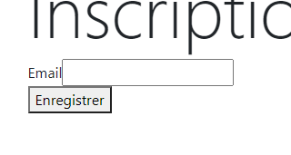
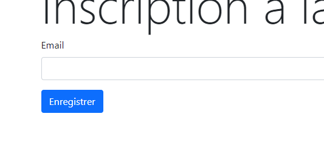

# 在 Twig 範本中顯示表單

要顯示表單，我們的控制器需要向視圖傳遞一個 `FormView` 物件。 事實上，如果我們在控制器中使用 `renderForm` 方法，Symfony 就會自動建立 FormView 物件：

```php
public function index(Request $request, EntityManagerInterface $em): Response
{
  $newsletter = new Newsletter();
  $form = $this->createForm(NewsletterType::class, $newsletter);

  $form->handleRequest($request);

  if ($form->isSubmitted() && $form->isValid()) {
    $newsletter->setCreated(new DateTime());
    $em->persist($newsletter);
    $em->flush();
  }

+ return $this->renderForm('newsletter/register.html.twig', [
+   'form' => $form
+ ]);
}
```

然後，在檢視中可以使用可用的 Twig 方法顯示表單。

最基本的是 `form` 方法

```php
{{ form(form) }}
```

此方法只產生**整個**表單的 HTML 程式碼。

如果想要對表單的顯示方式有更多控制，我們可以使用[自定義方法](https://symfony.com/doc/5.4/form/form_customization.html)。 可以找到所有由 Symfony 創建的 Twig 擴展方法，用於顯示字段標籤、單獨字段等。 這可以讓我們更好地控制希望顯示表單的方式。

## 為表單應用主題

我們可以使用 Symfony 提供的不同主題。 在我們的例子中，由於使用的是 Bootstrap，我們可以告訴 Twig 使用對應的主題。

因此，在 Twig 軟體包配置`（config/packages/twig.yaml）`中 ：

```yaml
twig:
    # ...
    form_themes: ["bootstrap_5_layout.html.twig"]
```

應用主題前 ：



使用主題後 ：


