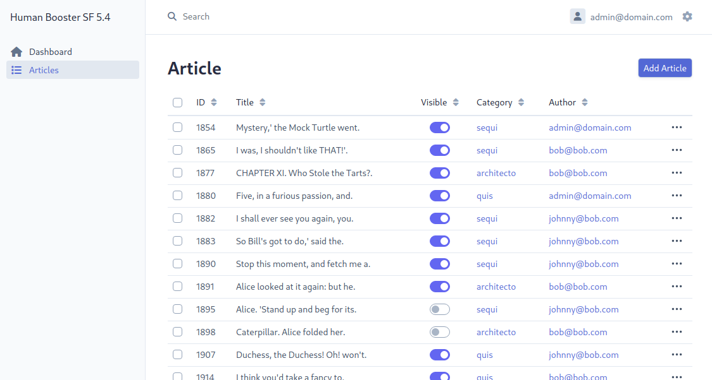

# EasyAdmin - 簡介

`make:crud` 指令雖然時常有用，但很快就會受到限制。

我們也可以安裝一個完整的管理包：`EasyAdminBundle`。 接下來，我們將對它進行一些配置，以便它能在我們的文章中自動產生 CRUD。 這個 CRUD 的外觀與 `make:crud` 指令完全不同：


## 安裝

始終使用 Composer：

```bash
composer require easycorp/easyadmin-bundle
```

:::note symfony flex 別名
我們也可以使用 Symfony Flex 別名：

```bash
composer require admin-gen
composer require admin-generator
composer require admin
```

:::

## 儀表板

一旦安裝了包，就需要建立一個儀表板：

```bash
php bin/console make:admin:dashboard
```

然后，可以重新启动服务器并转到 `/admin`，在那里将找到一个默认的首页。

在代码中，Maker 命令创建了一个 `DashboardController`。在这个文件中，我们可以配置我们的管理界面的入口点。

## 自動 CRUD

如果我們想要配置，例如，在進入管理介面時要顯示所有文章的列表，首先需要為文章產生一個 CRUD：

```bash
php bin/console make:crud
```

這將引導您透過幾個步驟設定文章實體的 CRUD。 完成後，您可以在儀表板上配置文章的清單檢視。

```bash
php bin/console make:admin:crud
```

我們選擇實體 `Article`，然後 Maker 引導我們建立 CRUD。 該命令創建了一個非常輕量級的類，幾乎是空的。 實際上，它繼承自 EasyAdmin 提供的 `AbstractCrudController`，其中已經包含許多功能。

我們可以使用相同的命令為類別(category)準備另一個 CRUD。

## 首頁

為了設定從首頁直接進入文章的 CRUD，我們回到儀表板，修改控制器 `index`（上面的路由註解告訴我們這是控制器在 URL `/admin` 後面）：

```bash
#[Route('/admin', name: 'admin')]
public function index(): Response
{
  //return parent::index();

  // Option 1. You can make your dashboard redirect to some common page of your backend
  //
  $adminUrlGenerator = $this->container->get(AdminUrlGenerator::class);
  return $this->redirect($adminUrlGenerator->setController(ArticleCrudController::class)->generateUrl());

  //...
}
```

進入管理頁面時，將自動重新導向至文章清單。

## 與類別的自動關聯

在 `ArticleCrudController` 類別中，我們將配置在文章表單中可以找到的各個欄位：

由註解告訴我們這是控制器在 URL `/admin` 後面）：

```bash
public function configureFields(string $pageName): iterable
{
  return [
    IdField::new('id'),
    TextField::new('title'),
    BooleanField::new('visible'),
    AssociationField::new('category')->autocomplete(),
  ];
}
```

:::note 注意
`自動完成`方法的目的是產生一個下拉列表，我們可以在其中開始輸入文字並自動產生自動完成的建議。 。
:::

## 顯示相關類別

您可能會收到類似 `Could not convert App\Entity\Category to string`
的錯誤訊息。

在這種情況下，您只需為 PHP 提供一種以字串形式表示類別的方法：透過其名稱。

為此，我們將 `Category` 實作一個 PHP 魔術方法 ： `__toString()` 方法：

```bash
class Category
{
  //...
  public function __toString()
  {
    return $this->name;
  }
  //...
}
```

這樣，EasyAdmin 就能在項目清單和項目表單的下拉清單中顯示類別名稱。

...note 魔法方法
`__toString()` 和 `__construct()` 一樣，是魔法方法。 當你嘗試 `echo` 一個物件時，它會被自動呼叫。

最後，透過相對較少的努力，我們就可以快速獲得一個相當豐富且易於瀏覽的管理介面。 在文章表單中，有一個帶有自動完成功能的類別下拉清單。
