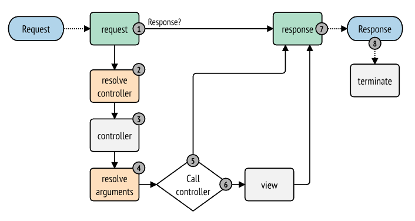

# 事件監聽器

**事件監聽器**，顧名思義，是事件的監聽器。

當建立一個事件監聽器時，我們編寫的程式碼片段將在特定事件發生時執行。 然後，我們指定我們的監聽器應該監聽哪個事件，也就是何時它將被觸發。

## Symfony 的內核

`symfony/http-kernel` 元件負責將請求轉換為回應。 我們已經在討論接收請求、獲取資料、生成視圖渲染以及回傳回應時探討過這個元件的邏輯。

這個元件**基於**事件：它在其運行過程中整合了許多事件被觸發的地方，這意味著我們可以**監聽這些事件並在執行的特定時刻執行程式碼**。



## 編輯回應

我們修改發送給客戶端的回應，並新增一個我們自己建立的標頭。

為了將標頭包含在回應中，我們將監聽 Kernel 的 `kernel.response` 事件。 因此，我們將編寫一個監聽器，然後配置它以便在該事件發生時觸發。

我們將標頭定義為：`X-DEVELOPED-BY: MyCorp`。

## 撰寫監聽器

要編寫一個監聽器，只需編寫一個具有將被呼叫的方法的類別：

> src/EventListener/AddMyCorpHeaderListener.php

```php
<?php

namespace App\EventListener;

use Symfony\Component\HttpKernel\Event\ResponseEvent;

class AddMyCorpHeaderListener
{
  public function addHeader(ResponseEvent $event)
  {
    $response = $event->getResponse();

    $response->headers->add([
      'X-DEVELOPED-BY' => 'MyCorp'
    ]);
  }
}
```

當 `kernel.response` 事件被觸發時，事件派發器將向該事件的所有監聽器傳遞一個 `ResponseEvent` 類型的物件（您可以在這裡找到每個事件傳遞的物件清單）。

透過這個對象，我們可以使用 `getResponse` 方法來取得我們想要修改的回應。 然後我們只需添加我們自己的標頭。

## 監聽器的配置

為了設定我們的監聽器並指示它將監聽 `kernel.response` 事件，我們將修改 `config/services.yaml` 檔案。 請記住，`src/` 目錄中的所有類別都會自動註冊為服務。 因此，我們可以根據需要配置我們的服務。

我們將在文件底部添加與我們的監聽器類別相關的特定配置。 為了聲明它是一個監聽器，我們將為其添加一個 `kernel.event_listener` **標籤**：

> config/services.yaml

```yaml
App\EventListener\AddMyCorpHeaderListener:
    tags:
        - {
              name: kernel.event_listener,
              event: kernel.response,
              method: "addHeader",
          }
```

## 什麼是標籤？

就像我們可以為文章、照片等添加標籤以對其進行分類一樣，我們也可以為服務添加**標籤**，以便在 Symfony 中以特定方式註冊。

在這裡，透過將 `kernel.event_listener` 標籤應用於我們的服務，我們**告訴 Symfony 這是一個監聽器**。 然後，Symfony 將使用其他屬性，如 `kernel.response` 和 `method` ，精確地決定何時呼叫它。

在 Symfony 中找到包含的標籤，請點擊[這裡](https://symfony.com/doc/current/reference/dic_tags.html)。

## 新增監聽器的後果

現在，如果我們重新啟動應用程序，那麼在每個顯示的頁面回應中都會出現一個新的頭部 `X-Developed-By: MyCorp`。

因此，我們在 Symfony 核心 Kernel 執行過程中加入了一些邏輯，而我們不需要在所有控制器中編寫它。 只需配置監聽器，在適當的時機自動運行，我們就能夠將這個頭部添加到所有返回的回應中。
