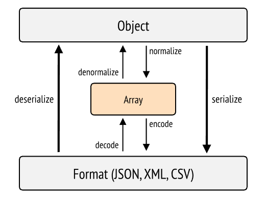

# 自訂傳回的數據

當將資料傳送到客戶端時，添加額外資訊可能是有用的。

例如，當我們以 JSON 格式發送我們的文章時，我們希望添加一個指向 Normalizer 的鏈接。 這是因為需要我們文章的外部服務也希望在我們的網站上建立一個指向原始文章的鏈接。

與其讓其他服務生成鏈接，我們將直接在返回的 JSON 中嵌入指向相應文章的完整鏈接。

## 標準化

我們已經看到 Symfony 的序列化器首先執行**標準化**步驟，將資料轉換為陣列格式，然後進行第二步**編碼**，將資料轉換為目標類型（JSON、XML、CSV 等）。



因此，我們要建立一個自訂 Normalizer 器，它將定義 Normalizer 在 陣列中的表現形式。

## 建立標準化器

我們可以使用製作工具來建立標準化器：

```bash
php bin/console make:serializer:normalizer
```

如果我們將其命名為 `ArticleNormalize`r，那麼 maker 將在 `src/Serializer` 資料夾中建立一個新類別：

```php
<?php

namespace App\Serializer\Normalizer;

use Symfony\Component\Serializer\Normalizer\CacheableSupportsMethodInterface;
use Symfony\Component\Serializer\Normalizer\NormalizerInterface;
use Symfony\Component\Serializer\Normalizer\ObjectNormalizer;

class ArticleNormalizer implements NormalizerInterface, CacheableSupportsMethodInterface
{
  public function __construct(private ObjectNormalizer $normalizer)
  {
  }

  public function normalize($object, string $format = null, array $context = []): array
  {
    $data = $this->normalizer->normalize($object, $format, $context);

    // TODO: add, edit, or delete some data

    return $data;
  }

  public function supportsNormalization($data, string $format = null, array $context = []): bool
  {
    return $data instanceof \App\Entity\Article;
  }

  public function hasCacheableSupportsMethod(): bool
  {
    return true;
  }
}
```

### Normalizer 結構

預設情況下，我們的 Normalizer 實作了 2 個介面：`NormalizerInterface` 和 `CacheableSupportsMethodInterface`。 我們對第一個介面很感興趣，因為它要求實作 `supportsNormalization` 和 `normalize` 這兩個方法。

:::note 自動配置
在使用自訂投票器或事件訂閱器時，我們已經看到了這一點：自動配置會檢測到類別實現的接口，並自動為其添加一個標記。

例如，自訂投票器就是這樣被自動標記為 `security.voter`。

在這裡，我們的 normalizer 被自動標記為 `serializer.normalizer`。

你可以在以下命令的輸出中找到它：

```bash
php bin/console debug:container --tag serializer.normalizer
```

:::

Symfony 會註冊應用程式中存在的所有 normalizers （包括序列化器中預設包含的 normalizers ），當需要標準化資料時，它會呼叫 `supportsNormalization` 方法來查詢這些 normalizers 。

只有當資料 (`$data`) 是文章類別的實例時，我們的 normalizers 才會回應支援規範化。 這正是我們想要的，因為我們希望我們的 normalizers 負責處理文章。

當我們的 normalizers 回答可以處理文章時，Symfony 將執行 `normalize` 方法。

## 新增數據

當我們想要標準化時，我們是否真的想要列出文章的所有字段，還是只是為了添加它的 URL？

我們是否更願意執行最初由 Symfony 預定的標準化（就像我們現在所做的那樣），然後再添加我們的數據？

這正是由 Maker 創建的類別中預先考慮的：

```php
public function __construct(private ObjectNormalizer $normalizer)
{
}

public function normalize($object, string $format = null, array $context = []): array
{
  $data = $this->normalizer->normalize($object, $format, $context);

  // TODO: add, edit, or delete some data

  return $data;
}
```

當我們建構 normalizer 時，會自動注入一個 `ObjectNormalizer` 實例。

這個 `ObjectNormalizer` 實際上是用來將我們的文章轉換為陣列的：它是我們目前在客戶端看到的表示形式。

因此，在我們的 `normalize` 方法中，邏輯非常簡單：首先，我們將要求初始 normalizer 對文章進行標準化，然後，一旦我們獲得了資料（`$data` 數組），我們將根據自己的需求進行自訂。

記住：我們要為文章新增 URL。 為此，我們需要透過 `UrlGeneratorInterface` 使用路由器。 因此，我們將把它注入到 normalizer 中，然後在 `$data` 中加入文章的 URL：

```php
<?php

namespace App\Serializer\Normalizer;

use App\Entity\Article;
use Symfony\Component\Routing\Generator\UrlGeneratorInterface;
use Symfony\Component\Serializer\Normalizer\CacheableSupportsMethodInterface;
use Symfony\Component\Serializer\Normalizer\NormalizerInterface;
use Symfony\Component\Serializer\Normalizer\ObjectNormalizer;

class ArticleNormalizer implements NormalizerInterface, CacheableSupportsMethodInterface
{
  public function __construct(
    private ObjectNormalizer $normalizer,
    private UrlGeneratorInterface $urlGenerator
  ) {
  }

  public function normalize($object, string $format = null, array $context = []): array
  {
    $data = $this->normalizer->normalize($object, $format, $context);

    if (!$object instanceof Article) {
      return $data;
    }

    $data['url'] = $this->urlGenerator->generate('article_show', ['id' => $object->getId()], UrlGeneratorInterface::ABSOLUTE_URL);

    return $data;
  }

  public function supportsNormalization($data, string $format = null, array $context = []): bool
  {
    return $data instanceof Article;
  }

  public function hasCacheableSupportsMethod(): bool
  {
    return true;
  }
}
```

因此，我們將 URL 作為自訂資料新增至 API 傳回的文章中。

在 Postman 中，我們將得到類似下面的內容：

```json
[
    {
        "id": 680,
        "title": "As there seemed to think to herself, and once.",
        "date_created": "01/03/2022",
        "content": "Alice, 'it's very easy to know what to ...",
        "category": {
            "id": 73,
            "name": "necessitatibus"
        },
        "url": "http://localhost:8000/article/show/680"
    },
    {
        "id": 681,
        "title": "Gryphon: and Alice was thoroughly puzzled. 'Does.",
        "date_created": "27/02/2022",
        "content": "For instance, if you ...",
        "category": {
            "id": 74,
            "name": "ut"
        },
        "url": "http://localhost:8000/article/show/681"
    }
    //...
]
```
