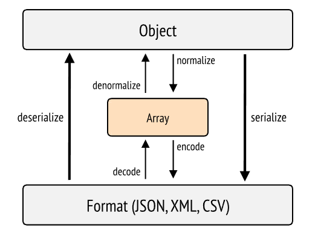

# 序列化

在 `--webapp` 模式下，Symfony 已經安裝並預先配置了一整套軟體包，可以在**全棧(full-stack)**模式下工作。

在這種模式下，Symfony 應用程式能夠接收請求，將其路由到正確的控制器，呼叫資料庫，然後產生 HTML 回應並發送回客戶端。 這就是**核心(Kernel)**的工作方式，正如我們在事件一章中所看到的。

但是，我們越來越希望返回 HTML 以外的內容。

## 返回 JSON

最常見的情況是應用程式作為**API**運行：通常是使用 Javascript 開發的前端應用程式來處理整個使用者介面。

在這種情況下，伺服器（後端）只是**向客戶端提供原始、未格式化資料的媒介**。 客戶端負責管理資料的顯示和與使用者的互動。

前端和後端之間交換資料通常使用的格式是**JSON**。

但在後端，我們需要一種以這種格式提供資料的方法。

這就是所謂的**資料序列化**。

:::info 序列化
序列化是一種將 PHP 物件轉換為其他格式（JSON、XML、YAML、CSV 等）的過程。

在 API 模式下運行時，我們將重點放在 JSON 格式。 但必須牢記，序列化並**不僅僅是**將資料轉換為 JSON，它是一種可以針對其他線性化格式進行轉換的過程。
:::

## 歷史遺留問題

實際上，我們已經遇到從 PHP 轉換為其他格式的問題，如果我們曾經使用過 SPL（標準 PHP 函式庫）的函數，例如 `json_encode` 或 [`serialize`](https://www.php.net/manual/en/function.serialize)。

每次我們都會遇到這樣的問題：如何將 PHP 中的物件（或陣列）轉換成另一種格式，以便儲存在資料庫中或被其他系統讀取？

Symfony 的 `symfony/serializer` 組件就是用來回答這個問題的。

## symfony/serializer 組件

基本上，Symfony 的 serializer 在序列化過程中使用**兩個步驟**：

-   **規範化**：將要序列化的元素轉換成陣列。
-   **編碼**：將給定數組轉換為目標格式：JSON、XML、CSV 等。

可在官方網站上查看圖片：

该组件对于将数据库中的数据（即实体实例）以 JSON 格式发送到客户端非常有用。

它还提供了许多选项和扩展点，使我们能够自定义数据序列化的方式。
