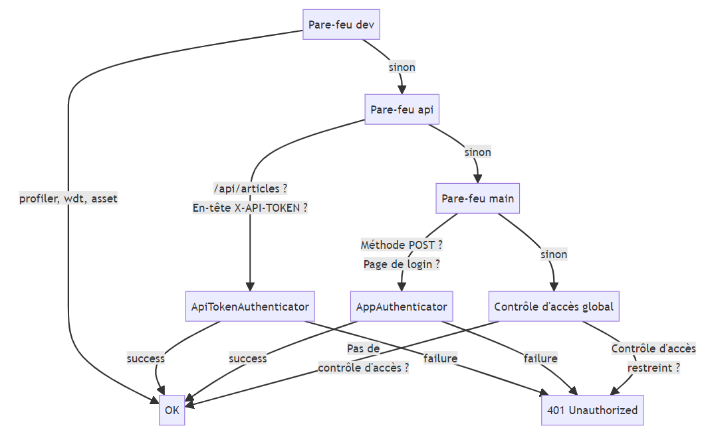

# 身份驗證與 API 令牌

身份驗證與 API 令牌

現在我們有了一個返回文章的端點，我們希望透過身份驗證來保護它，以便將其使用限制為某些用戶。

為此，我們將要求客戶端在其請求中附帶一個 `X-API-TOKEN` 標頭。 伺服器的作用將是提取此標頭，然後驗證令牌是否有效（在資料庫中註冊）。

## 運作方式

我們將要建立的 API 將整合到一個使用 `--webapp` 模式建立的全端應用程式中。 因此，我們已經有了一個透過登入表單進行身份驗證的機制和 `User` 安全類別。

對於我們的 API，我們希望有一個稍微不同的系統：我們想要保留登入表單和我們的普通用戶，以便他們可以登入並使用應用程式建立文章等等... 但我們希望外部用戶、其他服務或 應用程式可以存取我們的應用程式介面部分，以便讀取我們的 JSON 格式文章。

因此，我們不會將 API 金鑰整合到現有的 `User` 類別中，而是建立一個新的安全類別 `ApiToken`，並將其儲存在資料庫中。

這個類別將成為一個表，攜帶一個身份驗證令牌，用於授權或拒絕存取我們的 API。

因此，任何對我們的 API 發出請求的客戶端都必須在請求的頭部中附加其令牌。 透過帶有令牌的頭，我們才能辨識請求。

## 安全類

要建立一個安全性類，我們可以使用控制台的 `make:user` 指令。

因此，身份驗證資料將是一個我們將儲存在資料庫中的 `token` 列（因此我們希望將其作為 Doctrine 實體）。

然而，不需要任何密碼。 因此，我們不希望使用我們的 `ApiToken` 安全類別來雜湊或驗證密碼。 具體來說，這意味著什麼呢？ 這意味著 maker 建立的類別將只實作 `UserInterface` 介面而不是 `PasswordAuthenticatedUserInterface` 介面。

一旦我們正確回答了 maker 的問題以創建我們的新安全類，我們將產生一個遷移，並在審查後執行該遷移，以建立我們的新表。

:::note make:entity
在建立實體後，我們可以使用 `make:entity` 為實體新增其他欄位。

例如，我們將新增一個 `name` 字段，以便了解與請求相關聯的客戶端。 我們也可以新增一個請求計數器，以限制每天、每月等的請求次數。
:::

### 令牌提供者

Maker 會自動在設定檔 `config/packages/security.yaml` 中為我們的安全類別建立了一個提供者（**provider**）。

如果我們已經有一個現有的提供者（用於我們的 `User` 類別），它可能已經被覆寫了。 在這種情況下，讓我們重新配置以適應我們的操作：我們想要兩個提供者（providers），一個用於 `User`，一個用於 `ApiToken` ：

> `config/packages/security.yaml`

```yaml
security:
    enable_authenticator_manager: true
    # https://symfony.com/doc/current/security.html#registering-the-user-hashing-passwords
    password_hashers:
        Symfony\Component\Security\Core\User\PasswordAuthenticatedUserInterface: "auto"
    # https://symfony.com/doc/current/security.html#loading-the-user-the-user-provider
    providers:
        # used to reload user from session & other features (e.g. switch_user)
        app_user_provider:
            entity:
                class: App\Entity\User
                property: email
        api_token_provider:
            entity:
                class: App\Entity\ApiToken
                property: token
```

## 防火牆（Firewall）

為了捕獲 API 請求並透過身份驗證對其進行保護，我們需要在配置中新增一個**防火牆**。

透過將其配置為特定 URL 格式，我們可以**隔離**API 請求並將其提交給我們的身份驗證機制。

在配置的 `firewalls` 部分，我們將新增一個名為 `api` 的防火牆：

```yaml
firewalls:
    dev:
        pattern: ^/(_(profiler|wdt)|css|images|js)/
        security: false
    api:
        pattern: /api/articles
        provider: api_token_provider
    main:
    #...
```

:::danger 縮排

注意 YAML 格式和縮排！
:::

我們定義的模式非常具體：因為我們只有一個 `/api/articles` 端點，所以暫時我們將為此 URL 定義一個防火牆。 將來，如果我們定義了更多的端點，例如以 `/api` 開頭等，我們可以擴展這個模式...

我們也指定了我們要使用的**提供者**：在本例中，我們的使用者提供者將是先前新增至提供者中的 `api_token_provider`。

## 認證器

安全類別和防火牆建立完成後，我們需要實施身份驗證機制，從請求頭（如果存在）中提取令牌，然後檢查資料庫中是否存在令牌，以便授權請求。

如我們所見，要建立認證器，我們可以使用 `make:auth` 命令。 但與前面建立登入表單的方式不同，我們將建立一個**空的**認證器（Empty Authenticator）。 實際上，maker 將產生一個預先填入的認證器類，然後由我們編寫各種方法的實作。

我們將這個認證器命名為 `ApiTokenAuthenticator`。

:::note 防火牆

maker 會偵測我們配置中存在的不同防火牆，並詢問我們要將認證器套用到哪個防火牆。 因此，我們將選擇 `api` 防火牆。
:::

建立的類別包含了從 `Symfony\Component\Security\Http\Authenticator\AuthenticatorInterface`介面繼承的各種方法：

-   `supports` 指示我們的認證器是否能夠根據傳入的請求對使用者進行認證。
-   `authenticate`允許從傳入的請求對使用者進行認證。 在這個方法中，我們將編寫認證的方式。 為此，我們將建立一個護照（`Passport`），然後將其傳回給安全元件。
-   `onAuthenticationSuccess` 指示如果認證成功，應該執行什麼操作。
-   `onAuthenticationFailure` 則指示相反的情況：如果認證失敗，應該執行什麼操作。

:::info 安全組件

所有這些方法都是由安全元件**自動**呼叫的，它會偵測並註冊應用程式中存在的認證器。

因此，我們正在提供一個**新的行為**，這將整合到安全組件執行的整個過程中。

### `supports`

這是安全元件呼叫的第一個方法。 它的目的是檢查我們的認證器是否可以使用。

在我們的例子中，我們將指示**只有**當請求包含 `X-API-TOKEN` 頭時，我們才能對其進行認證：

:::

```php
class ApiTokenAuthenticator extends AbstractAuthenticator
{
  // 令牌名称存储在一个常量中，因此其值可以在多个地方重复使用
  private const TOKEN_NAME = 'X-API-TOKEN';

  public function supports(Request $request): ?bool
  {
    return $request->headers->has(self::TOKEN_NAME);
  }

  //...
}
```

如果我們的 `supports` 方法回傳 `true`，安全元件將會呼叫 `authenticate` 方法。 否則，它將繼續到先前註冊的下一個 Authenticator。

### `authenticate`方法

這是主要方法，我們接收傳入的請求，並使用它來建置並傳回一個 `Passport`。

我們將從請求頭中提取令牌（同樣，我們可以檢查它是否存在），然後建立一個 `SelfValidatingPassport` 。

```php
public function authenticate(Request $request): Passport
{
  $token = $request->headers->get(self::TOKEN_NAME);

  if ($token === null) {
    throw new CustomUserMessageAuthenticationException('No token provided');
  }

  return new SelfValidatingPassport(new UserBadge($token));
}
```

讓我們深入了解 `Passport`：

-   我們使用 `SelfValidatingPassport` 而不是傳統的 `Passport`，因為傳統的 `Passport` 通常期望`Credentials` 憑證（例如密碼）以及 `UserBadge`。 在我們的情況下，我們沒有密碼：偵測和檢索令牌就可以授權請求。 因此，`SelfValidatingPassport` 可用於在沒有任何憑證的情況下傳遞 `UserBadge`。

-   `UserBadge` 需要一個**使用者標識符**，這裡是我們的令牌。 這就是為什麼我們在建立安全類別時將 `token` 列指定為識別欄位的原因：**這是用於找回使用者的資料**。

-   `UserBadge` 也可以選擇接收一個匿名方法，用於查詢與識別碼關聯的使用者。 在這裡，我們沒有提供這個可選參數，因為在建立安全類別時，我們也新增了一個用於我們的令牌的提供者 provider。 這就是我們在防火牆配置中指定的提供者 provider。

-   因此，`UserBadge` 將負責使用適當的提供者找回使用者。 一般來說，`UserBadge` 將嘗試建立實作 `UserInterface` 的類別的實例。 這就是為什麼我們創建安全類別的原因：`ApiToken` 類別實作了 `UserInterface`。

### `onAuthenticationSuccess`

這個方法告訴安全元件在驗證成功時應該執行什麼操作。

我們將返回 `null`，這意味著我們**可以讓請求繼續發送到控制器**：

```php
public function onAuthenticationSuccess(Request $request, TokenInterface $token, string $firewallName): ?Response
{
  return null;
}
```

:::note TOKENINTERFACE(令牌介面)
實作 `TokenInterface` 的物件實例可用於檢索已通過身份驗證的用戶
:::

### `onAuthenticationFailure`

另一方面，如果身份驗證失敗（令牌不正確），我們希望傳回 JSON 格式的回應，其中包含錯誤訊息和相應的回應代碼：

```php
public function onAuthenticationFailure(Request $request, AuthenticationException $exception): ?Response
{
  return new JsonResponse(
    ['message' => 'Unable to authenticate'],
    Response::HTTP_UNAUTHORIZED
  );
}
```

### `security.yaml` 配置

最後，在安全元件的設定檔中，由於我們在建立驗證器時選擇了 `api` 防火牆，我們可以看到它已經正確配置：

```yaml
api:
    pattern: /api/articles
    provider: api_token_provider
    custom_authenticator: App\Security\ApiTokenAuthenticator
```

## 存取控制

如果我們重新啟動伺服器，在這個階段，我們應該能夠從像 Postman 這樣的客戶端發出請求而不會出現錯誤。

但無論是否輸入令牌，請求都能正常運作 🤔

最令我們困擾的是，**當我們不提供任何令牌時**，請求仍然有效。

事實上，讓我們回想一下 `Authenticators` 的工作原理：安全元件首先透過 `supports` 方法詢問不同的 authenticators，以確定是否呼叫它們的 `authenticate` 方法。

但是如果我們沒有提供任何令牌，那麼我們的 `ApiTokenAuthenticator` 就簡單地表示它**不支援**身份驗證。

因此，如果在請求的標頭中沒有提供任何令牌，我們的 authenticator 甚至不會被執行。

仔細想想，這就說得通了：如果沒有 `X-API-TOKEN` 標頭，那可能與我們的 `api` 防火牆無關，因此我們的 `ApiTokenAuthenticator` 甚至不會執行...

因此，我們需要在 `/api/articles` URL 上設定**存取控制**，以便在該 URL 上強制進行身份驗證。

### 防火牆順序

防火牆的順序也很重要：當安全元件確定接受請求的防火牆時，它就**不再繼續尋找**。

在我們的例子中，我們有 3 個防火牆：

-   `dev` 用於 profiler、Web 偵錯工具列和資源相關的所有內容
-   `api` 用於我們的 `/api/articles` 端點
-   `main` 用於應用程式的其餘部分

因此，如前所述，如果我們沒有 `X-API-TOKEN` 標頭，安全元件會忽略 `api` 防火牆並前往 `main`。 而 `main` 從 `AbstractLoginFormAuthenticator` 抽象類別繼承了其 `supports` 方法:

```php
public function supports(Request $request): bool
{
    return $request->isMethod('POST') && $this->getLoginUrl($request) === $request->getBaseUrl().$request->getPathInfo();
}
```

由於它不支援身份驗證，因此也允許請求通過！ 這就是為什麼我們甚至不需要提供 `X-API-TOKEN` 標題就能以 JSON 格式顯示文章的原因。



因此，如果我們不為 /api/articles URL 提供 API 令牌，就會退回到全域存取控制：

> config/packages/security.yaml

```yaml
#...
access_control:
    - { path: /api/articles, roles: IS_AUTHENTICATED_FULLY }
```

:::note `IsGranted` 屬性
我們也可以使用 SensioFrameworkExtraBundle 中的 `IsGranted` 屬性，直接在控制器上定義存取控制：

```php
use Sensio\Bundle\FrameworkExtraBundle\Configuration\IsGranted;

//...

#[Route('/api/articles', name: 'app_api_article')]
#[IsGranted('IS_AUTHENTICATED_FULLY')]
public function index(ArticleRepository $articleRepository): Response
{
  $articles = $articleRepository->findAll();
  return $this->json($articles, context: ['groups' => 'articles:read']);
}
```

:::

如果我們嘗試在不提供令牌的情況下存取 `/api/articles`，將收到 `401 Unathorized` (未授權)錯誤。

## 有狀態？ 無狀態？

如果提供有效令牌，則請求正常工作，我們就可以存取 JSON 格式的文章清單。

但如果我們在沒有令牌的情況下再次嘗試，我們仍然可以存取資源...

這不符合我們想要的功能：我們希望**在每個請求中提取和標識我們的令牌**。

為此，我們必須切換到**無狀態**模式，因為目前，如果我們能夠使用有效的令牌執行請求，則會**啟動一個 PHP 會話**。

為確保每次請求都能正確驗證，我們將把 `api` 防火牆切換為無狀態模式。

```yaml
firewalls:
    dev:
        pattern: ^/(_(profiler|wdt)|css|images|js)/
        security: false
    api:
        pattern: /api/articles
        stateless: true
        provider: api_token_provider
        custom_authenticator: App\Security\ApiTokenAuthenticator
    #...
```
