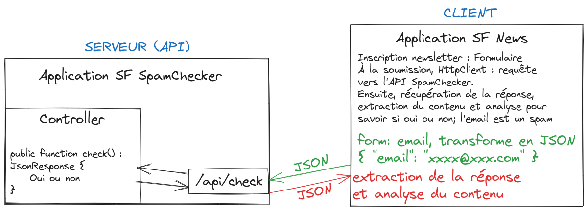

# 實作練習：API - 垃圾郵件檢查器

在本次練習中，我們將建立一個小型 API，用於檢查電子郵件是否為垃圾郵件。

目標很簡單：接收來自請求的電子郵件，然後檢查其網域是否在被視為垃圾郵件的網域的陣列中。 最後，我們將以 JSON 格式回傳回應，告訴客戶端檢查結果。

然後，我們將希望從 news 應用程式中使用此 API，以在訂閱時驗證電子郵件是否不是垃圾郵件。

## 請求格式

為了請求我們的 API，我們決定使用 `POST` 方法，並在請求正文中指明要檢查的電子郵件。

這樣，一個請求可以包含這類資料：

```json
{ "email": "test@test.com" }
```

## 回應格式

回應的格式可能各不相同，但我們假定回應格式如下：

```json
{ "result": "ok" } // 該郵件不是垃圾郵件
```

```json
{ "result": "spam" } // 該郵件是垃圾郵件
```

## 創建應用程式

在 API 模式下建立 Symfony 應用程式時，**請勿使用** `--webapp` 選項：

```bash
symfony new spam-checker --version=5.4

```

這種類型的應用程式預設包含的依賴關係要少得多。 這樣，應用程式就更輕了。

### 開發依賴

為了能夠在本地工作，我們仍然要添加 profiler 和 maker 作為開發依賴：

```bash
composer require --dev profiler maker


```

:::info 別名
`profiler` 和 `maker` 是 Symfony Flex 的別名。 它們將在安裝過程中由 Symfony Flex 解析，然後使用真正的軟體包名稱（格式： `vendor/package`）。
:::

## 總結

應用程式的目標概括如下示意圖：

