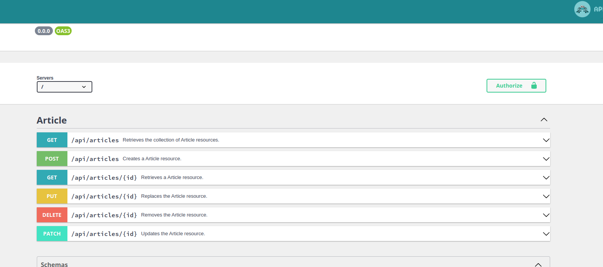

# API 平台集成

API Platform 是一個框架，可以直接從現有應用程式建立和公開 API。

## 它有什麼作用？

API Platform 在應用程式中非常有用，因為它具有許多本地支援的功能：

### RESTful API

預設情況下，API Platform 可以針對 Doctrine 實體產生完全符合 RESTful 的 CRUD。 因此，我們可以直接使用與我們希望在資源上執行的不同操作相對應的 HTTP 動詞查詢 API。

### Swagger/OpenAPI 文檔

除了產生 CRUD 之外，我們還可以從瀏覽器中查看自動產生的 Swagger/OpenAPI 文件。

### GraphQL

API Platform 向客戶端公開了一個 REST API。 也可以將其轉換為 GraphQL API。

### CORS 和身份驗證

使用 `nelmio/cors-bundle` 包，可以實現 CORS 支持，使用 `lexik/jwt-authentication-bundle` 軟體包可輕鬆添加 JWT 身份驗證。

### JSON-LD 和 Hydra

JSON-LD JSON 是連結資料(**JSON for Linking Data**) 的縮寫。 這種格式允許我們為存取 API 的機器在資源中添加更多資訊。 API Platform 會**自動**將附加屬性整合到 API 傳回的 JSON 內容中，如 `@id` 用於透過 URI 唯一識別資源，或 `@type` 用於指定資源類型等。

除了 JSON-LD 之外，Hydra 還會在我們的回應中添加**更多**資訊。 事實上，Hydra 為超媒體內容定義了一個[完整的詞彙表](https://www.hydra-cg.com/spec/latest/core/)。 超媒體(**Hypermedia**)是 **HATEOAS（Hypermedia As The Engine Of Application State，超媒體作為應用狀態的引擎）** 中的"**H**"，這一 REST 原則表明，提供能讓客戶端繼續與 API 交互的信息可能是有用的。

這樣，`hydra` 資訊就會自動包含在我們的 API 回應中。 例如，如果我想要一個項目列表，那麼下一頁、上一頁和項目總數的資訊都將包含在內：

```json
{
    // Collection d'articles...

    "hydra:totalItems": 150,
    "hydra:view": {
        "@id": "/api/articles?page=1",
        "@type": "hydra:PartialCollectionView",
        "hydra:first": "/api/articles?page=1",
        "hydra:last": "/api/articles?page=5",
        "hydra:next": "/api/articles?page=2"
    }
}
```

## 安裝和建立第一個資源

要安裝 API Platform，可以使用其 Flex 別名 api ：

```bash
compose require api
```

接下來，我們將在 `Article` 實體中新增 `ApiResource` 屬性，以自動建立 REST CRUD：

```php
use ApiPlatform\Metadata\ApiResource;
//...

#[ORM\Entity(repositoryClass: ArticleRepository::class)]
#[ApiResource]
class Article
{
}
```

然後，我們就可以重新啟動伺服器，查閱 URL `/api` 後面的文件。

:::caution API 平台 2.7 + symfony 5
API Platform v2.7 中進行了重大修改。

當時引入了 ApiPlatform 元資料命名空間。 為了正確偵測資源，必須在 API Platform 設定檔中新增一個參數：

> config/packages/api_platform.yaml

```yaml
api_platform:
    metadata_backward_compatibility_layer: false

    #...
```


:::

## 序列化組

如果我們直接測試其中一個端點，可能需要調整序列化組，以避免無限循環：

```php
#[ApiResource(
  normalizationContext: ['groups' => ['articles:read']]
)]
class Article
{
}
```

這樣，我們就可以在自己選擇的類別屬性中使用該群組。
