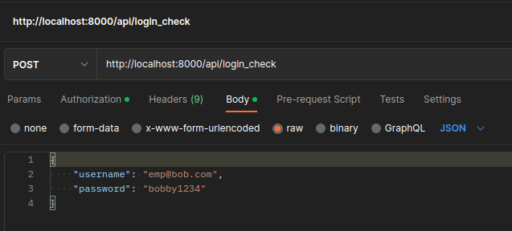
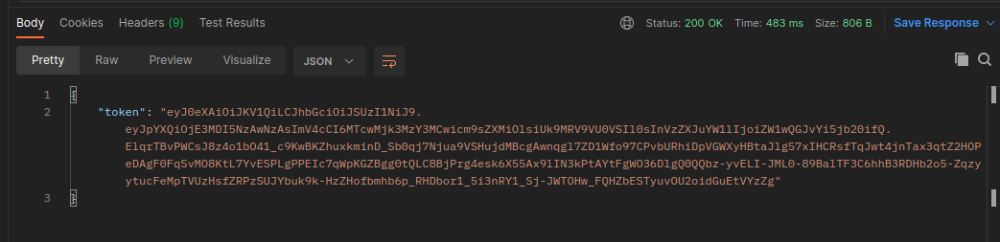

# JWT 身份驗證

要在我們的 Symfony API 中新增 JWT（**J**SON **W**eb **T**oken）身份驗證，可以使用[LexikJWTAuthenticationBundle](https://github.com/lexik/LexikJWTAuthenticationBundle)捆綁包。

:::info API PLATFORM
儘管本章在 API Platform 部分有所涉及，但 JWT 驗證完全可以在不使用 API Platform 的 API 中使用。
:::

## 目的

JWT 身份驗證通常用於確保和維護用戶端（如 JS 應用程式或行動應用程式）與 API 之間的身份驗證。

### 原則

其工作原理如下：

-   在前端進行身份驗證，然後取得包含 JWT 的後端回應。
-   找到一種在前端儲存 JWT 的方式。
-   在隨後發送到後端的每個請求中，將 JWT 附加到 [`Authorization`](https://developer.mozilla.org/en-US/docs/Web/HTTP/Headers/Authorization) 標頭中。
-   因此，**伺服器**負責驗證 JWT。
-   伺服器**不儲存**JWT，它只是在連接時將其返回，然後在隨後的請求中驗證它。

## 與 API 令牌身份驗證的區別

API 令牌身份驗證通常用於授權應用程式存取我們的資料。

例如，[TMDB](https://www.themoviedb.org/) 網站可讓您在其網站上瀏覽整個電影資料庫。 但該網站還包含一個 [API 部分](https://developer.themoviedb.org/docs)，其中說明如何註冊和建立 TMDB 系統的存取金鑰。

有了這個 API 金鑰，我們就能編寫自己的應用程序，發出 HTTP 請求並從 TMDB 取得 JSON 格式的資料。

然後，由於我們的 API 令牌儲存在 TMDB 中，因此他們可以保留我們的請求歷史記錄，或施加限制（每分鐘、每天、每月等），超過這些限制，我們可能需要訂閱付費服務。

因此，令牌 API 身份驗證通常被用作向第三方應用程式提供系統的商業模式。

JWT 不會儲存在伺服器上。

因此，在資料庫中，確實儲存使用者名稱和密碼。 更重要的是，由於 JWT 有生命週期，因此可以在規定的時間內確保和維護身份驗證。

這就是為什麼通常的使用場景更傾向於創建客戶端應用程序，如 React/Vue/Svelte/Angular，它將管理整個介面以及與用戶的交互，而 API 只代表對資料層的存取。

在客戶端應用程式中，我們可以顯示一個登入表單，並在提交時向 API 發送輸入的憑證。 如果輸入正確，API 將傳回一個 JWT。

| API 令牌                     | JWT (JSON Web Token)                            |
| ---------------------------- | ----------------------------------------------- |
| 無生命週期（儲存在資料庫中） | 生命週期由配置定義，不儲存於伺服器端            |
| 無需憑證， 僅令牌足夠        | 首先需要憑證產生 JWT，然後在請求中包含 JWT 頭部 |

## 安裝和配置

[LexikJWTAuthenticationBundle](https://github.com/lexik/LexikJWTAuthenticationBundle/blob/2.x/Resources/doc/index.rst#installation)的文件相當清楚。

### 安裝

```bash
composer require lexik/jwt-authentication-bundle
```

使用 Symfony Flex，該捆綁包將自動註冊到 `config/bundles.php` 檔案中。

### 產生 SSL 金鑰

由於 JWT 並未儲存在伺服器端，因此一旦生成，它就會被發送出去。 因此，任何人都可以透過在請求頭中指定 JWT 向我們的應用程式介面發出請求。

在伺服器端，確保 JWT 有效非常重要，因為我們要確保確實是本伺服器產生了 JWT。

為此，我們使用一對 SSL 金鑰（公鑰和私鑰）來**簽署** JWT。

接下來是兩個不同的階段：

-   產生 JWT 時（如果憑證正確），我們使用**私鑰**簽署 JWT。
-   當收到帶有 JWT 的 API 請求時，我們會使用**公鑰**來檢查伺服器是否確實進行了簽署。

這可以防止應用程式以外的任何參與者自己產生 JWT 並試圖冒充他人。

安裝時，捆綁包在控制台中註冊了一些命令，包括以下命令，用於自動產生金鑰對：

```bash
php bin/console lexik:jwt:generate-keypair
```

:::note WINDOWS
如果命令不起作用，可能需要安裝 OpenSSL：請參考此[鏈接](https://ld-web.github.io/hb-sf-pe7-course/assets/files/Win64OpenSSL_Light-3_2_0-c3a0d56c155da61f081593eb971ccb14.msi)

然後再次嘗試運行該命令
:::

金鑰將自動產生在 `config/jwt` 資料夾中，並被 Git 忽略。

### 配置

在環境變數檔案中，可以自訂：

-   私鑰的路徑
-   公鑰的路徑
-   用於產生和簽名令牌的口令

在安全套件的設定檔（`config/packages/security.yaml`）中，我們需要新增所需的防火牆：

```yaml
> config/packages/security.yaml

security:
  # ...
  firewalls:
    dev:
      pattern: ^/(_(profiler|wdt)|css|images|js)/
      security: false

    login:
      pattern: ^/api/login
      stateless: true
      json_login:
        check_path: /api/login_check
        success_handler: lexik_jwt_authentication.handler.authentication_success
        failure_handler: lexik_jwt_authentication.handler.authentication_failure

    api:
      pattern: ^/api
      stateless: true
      jwt: ~

    main:
      lazy: true
      provider: app_user_provider
  #...
```

:::caution 防火牆順序

注意防火牆的順序：這裡，`login` 和 `api` 防火牆位於 `main` 防火牆之前。 主防火牆是最通用的防火牆，它可以攔截 API 請求以外的所有請求。

安全元件不會檢查**所有**的防火牆：一旦發現與請求相符的防火牆，它就會停止並執行請求。
:::

最後，剩下要做的就是配置處理登入的路由：它已內建在 bundle 中，所以我們只需在應用程式中聲明它即可：

```yaml
> config/routes.yaml

api_login_check:
  path: /api/login_check
```

## 連接測試

:::info 檢查清單

測試 JWT 連接前，請檢查以下幾點：

-   要連線的用戶已在資料庫中註冊。
    -   建立使用者：
        -   透過使用 fixtures
        -   或直接向 /api/users 端點發出 POST 請求
-   用戶密碼已在資料庫中正確加密
-   使用 symfony serve --no-tls 指令重新啟動伺服器

:::

透過 Postman 等客戶端，可以在 URI `/api/login_check` 上建立連線請求：



檢查以下事項：

-   `POST` 請求
-   在"Body"標籤中，選擇"raw"格式，並在右側選擇"JSON"。

請求體（payload）的範例：

```json
{
    "username": "emp@bob.com",
    "password": "bobby1234"
}
```

API 應該會在響應體中回傳一個 JWT :



## 深入了解

### Cookie

傳統上，JWT 將在請求體中傳回，然後儲存在客戶端，例如在 localStorage 中。

這種方法的主要風險是使用者的 JWT 可能被竊取：在瀏覽器中執行的任何 JavaScript 程式碼都可以存取 localStorage 並提取 JWT。

成功竊取 JWT 的任何人都可以冒充用戶。

一種可以減少攻擊可能性的解決方案是透過 **cookies** 來傳輸 JWT。 此方法的一個特殊優點是，cookie 可以設定為 `httpOnly` ，因此無法透過 Javascript 存取。

可以對 [Lexik 捆綁程序進行配置](https://github.com/lexik/LexikJWTAuthenticationBundle/blob/2.x/Resources/doc/1-configuration-reference.rst#L118)，使其自動將令牌放入 cookie 而不是放入回應體中。

此外，為了確保瀏覽器接受伺服器傳回的 cookie，必須將 `Access-Control-Allow-Credentials` 回應頭設為 `true`。 例如，可以使用一個在 `kernel.response` 上的監聽器：

```php
<?php

namespace App\EventListener;

use Symfony\Component\HttpKernel\Event\ResponseEvent;

class ResponseListener
{
  public function onKernelResponse(ResponseEvent $event)
  {
    if (!$event->isMainRequest()) {
      return;
    }

    $response = $event->getResponse();
    $response->headers->set("Access-Control-Allow-Credentials", "true");
  }
}

```

### 刷新令牌

JWT 的主要缺點是當它被盜時它是**無狀態**的：只要它沒有過期，任何人都可以用它向我們的 API 提出請求，從而冒充他人。

為了減少攻擊面（但不能完全消除），我們還可以新增**刷新令牌(refresh token**)系統。

原理如下：

-   將 JWT 的生命週期設定得很短（例如 10 秒）。
-   在客戶端，當 JWT 過期時，會使用刷新令牌自動重新產生一個 JWT。
-   以此類推，對使用者來說都是透明的。

如果 JWT 被盜，惡意用戶就沒有太多時間使用它了，因為它很快就會過期。

如果刷新令牌被盜，那麼它與 JWT 有一個重大區別：**刷新令牌儲存在資料庫中**。 因此，可以使刷新令牌失效，以防止產生新的 JWT。

在 Symfony 中，可以使用 [JWTRefreshTokenBundle](https://github.com/markitosgv/JWTRefreshTokenBundle) 套件來整合這個功能。
